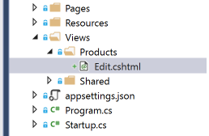

# Working with Razor Pages

## Creating Razor Pages

Using our application from Lab9, we are going to create a view for all of our products.

1. Open the ASP.NET Core application we worked on in __Lab 9: Docker__
1. In Solution Explorer, create a new folder called "Pages"
1. In Solution Explorer, right-click on the "Pages" folder choose: Add -> "Razor Page". Create a page called "ProductList"
1. Expand _ProductList.cshtml_ and open its corresponding _.cshtml.cs_ file
1. Create a constructor for the `ProductListModel` and add `OrdersContext` as a parameter:
```cs
    private readonly StoreContext _storeContext;

    public ProductListModel(StoreContext storeContext)
    {
        _storeContext = storeContext;
    }
```

1. Create the property to hold our store's products:

```cs
    public IEnumerable<Product> Products { get; set; }
```

1. On initialization of a Razor page, the framework adds `OnGet()` or `OnGetAsync()` so you can load the page with a simple GET method. Add the following method in `ProductListModel`:

```cs
    public async Task OnGetAsync()
    {
        Products = await _ordersContext.Products.ToListAsync();
    }
```
> __NOTE:__ If you want to add more handlers, you can do so with the OnVERB[Async] pattern (ie. `OnPostAsync()` or `OnPost()`). You can also add named handlers if you want multiple methods that use the GET, POST, PUT, DELETE verbs. They would be in the form OnVerbHandlerName[Async], like `OnGetViewAsync()`.

1. In _ProductList.cshtml_, ensure that the namespace for `@model` is correct. That is,
make sure that it is resolved or fix it by replacing it with the fully qualified name: `@model AspNetCoreWorkshop.Pages.ProductListModel`
    * __NOTE:__ If the `@model` needs to be fixed, please open and close _ProductList.cshtml_ page again to get Intellisense.

1. In _ProductList.cshtml_, add a `@using AspNetCoreWorkshop.Models;` after the `@model` line. It should look like this:

```cs
    @page
    @model AspNetCoreWorkshop.Pages.ProductListModel
    @using AspNetCoreWorkshop.Models;
    @{
        ViewData["Title"] = "ProductList";
    }
```

1. In _ProductList.cshtml_, add the following code after the `@section Scripts { }` to iterate through each product and display them as a table.  As you're typing, you should see Intellisense being provided.
```html
<table>
    <thead>
        <tr>
            <td>@nameof(Product.Id)</td>
            <td>@nameof(Product.Name)</td>
        </tr>
    </thead>
    @foreach (var product in Model.Products)
    {
        <tr>
            <td>@product.Id</td>
            <td>@product.Name</td>
        </tr>
    }
</table>
```

1. Start debugging and navigate to: http://localhost:8082/productlist

## Razor Pages: Further Reading
1. More information about Razor Pages can be found at [ASP.NET Core - Simpler ASP.NET MVC Apps with Razor Pages](https://msdn.microsoft.com/en-us/magazine/mt842512)

## Examining Tag Helpers

1. In  _ProductsController.cs_, change inheritance from `ControllerBase` to `Controller`
1. Remove `[Produces("application/json")]` and `[Route("/api/[controller]/")]` class decorations and move them onto each method.  It should look like the following:
```cs
    namespace Lab10.Controllers
    {
        public class ProductsController: Controller
        {
            [HttpGet]
            [Route("/api/[controller]/")]
            public async Task<IEnumerable<Product>> Get()
            { }

            [HttpGet]
            [Route("/api/[controller]/{id}")]
            public async Task<IActionResult> Get(int id)
            { }

            [HttpPost]
            [Route("/api/[controller]")]
            public async Task<IActionResult> Post([FromBody] Product product)
            { }
        }
    }
```

1. Add the following method to _ProductsController.cs_:
```cs
    [HttpGet]
    [Route("[controller]/{id}")]
    public async Task<IActionResult> Edit(int id)
    {
        var product = await _dataContext.Products.SingleOrDefaultAsync(p => p.Id == id);
        if (product == null)
        {
            return NotFound();
        }

        return View(nameof(Edit), product);
    }
```
1. Add a `Save` method to your `ProductsController`:
```cs
    [HttpPost]
    [Route("[controller]/{id}")]
    public async Task<IActionResult> Save([FromForm]Product product)
    {
        if (!ModelState.IsValid)
        {
            return View(nameof(Edit), product);
        }

        var update = _dataContext.Products.Update(product);
        await _dataContext.SaveChangesAsync();

        return Redirect("~/productlist");
    }
```

1. Generate the view by adding the following folders to the project: "Views" -> "Products"

    

1. Add a _Views/\_ViewImports.cshtml_ page that will be shared amongst your view pages.  The reason we have to add this is because we created a WebAPI application, if we had used the MVC template, this would have been provided already. Add its contents as:
```cs
    @using Lab10
    @using Lab10.Models
    @addTagHelper *, Microsoft.AspNetCore.Mvc.TagHelpers
    @addTagHelper *, Lab10
```

1. Right-click on the "Products" folder and select: "Add" -> "View..."
1. Fill in the following options and press "Add" when completed
    * __View name:__ Edit
    * __Template:__ Edit
    * __Model class:__ Product (Labs10.Model)

1. Update _Views/Products/Edit.cshtml_ form to point to the `ProductsController` and on form submit, will call the `Save` action with an HTTP POST.
    * __NOTE__: Notice as you are typing out the `<form asp-..` syntax that Intellisense is being provided for you. Notice that it is strongly typed as you are writing `<label asp-for`
```html
<div class="row">
    <div class="col-md-4">
        <form asp-controller="Products" asp-action="Save" method="post">
            <div asp-validation-summary="ModelOnly" class="text-danger"></div>
            <input type="hidden" asp-for="Id" />

            <div class="form-group">
                <label asp-for="Name" class="control-label"></label>
                <input asp-for="Name" class="form-control"/>
                <span asp-validation-for="Name" class="text-danger"></span>
            </div>
            <div class="form-group">
                <input type="submit" value="Save" class="btn btn-default" />
            </div>
        </form>
    </div>
</div>
```
1. Look at the Tag Helpers attributes being used in this view (examples: `asp-controller`, `asp-validation-summary`) and play around with setting the attributes and exploring the IntelliSense offered for the different attribute types
    > Note: To get tag helper Intellisense in VS2017 install the [Razor Language Service](https://aka.ms/razorlangsvc) extension

1. Run the application
1. Go to http://localhost:8082/products/4
1. Clear out the "Name" field and try to "Save" the product.
1. Notice how the validation errors are filled in now
1. Fill in the "Name" field with a value and "Save" it again

## Extra if you have time
1. Create your own Tag Helper using the guidance in [Authoring Tag Helpers](https://docs.microsoft.com/en-us/aspnet/core/mvc/views/tag-helpers/authoring)
