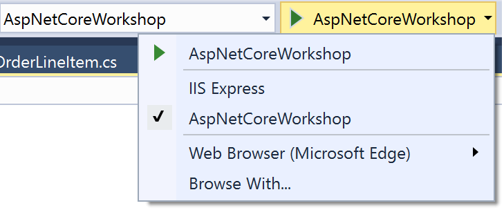

# ASP.NET Core Startup, Hosting, and Middleware
This fork of lab 3 material is meant to be used in engagements with customers 
who begin with a Web API project (lab 8) instead of with an MVC project.

## Create a new ASP.NET Core application

1. Open the lab 8 (or 8.5) project we've been working with

## Running the application under IIS

1. The application should be setup to run under IIS Express by default.
1. Look at *launchSettings.json* and notice that the app can run either with 
or without IIS. Make sure the launchUrl for both profiles is set to 'swagger'.
1. Run the application and observe the Swagger UI that is shown.

## Running the application on Kestrel directly

1. Change the Debug drop down in the toolbar to the application name as shown 
below.

  

1. Run the application and navigate to the root. It should show the same 
Swagger UI.
1. Change the port to `8081` by adding a call to `UseUrls` in the 
`Program.cs`:

   ```
    public static IWebHost BuildWebHost(string[] args) =>
        WebHost.CreateDefaultBuilder(args)
            .UseStartup<Startup>()
            .UseUrls("http://localhost:8081")
            .Build();
    }
   ```
1. Navigate to the project properties (by right clicking on the project, and 
selecting `Properties`)
1. Go to the `Debug` tab and change `App URL` to `http://localhost:8081`

   

1. Run the application and navigate to the root. It should show the web API 
 running on port 8081.

1. `UseUrls` only applies when running Kestrel directly since IIS hosting  
components will override the URL with data from IIS settings.

> **Note:** If the page does not load correctly, verify that the console 
application host is running and refresh the browser.

## Understanding Program.cs

1. In a web browser, navigate to https://github.com/aspnet/MetaPackages and 
then follow links src -> Microsoft.AspNetCore -> WebHost.cs to view source 
for the `CreateDefaultBuilder` method (which is used by our *Program.cs*). 
Notice what this method does.
    1. It specifies Kestrel as the web host
    1. It specifies a content root
    1. It configures application configuration
    1. It configures logging
    1. It adds IIS integration
    1. It customizes DI scope validation behavior
1. In many cases, these are fine defaults. But let's create our web host by 
hand so that it's easier to modify later, if needed.
1. Replace the `WebHost.CreateDefaultBuilder` call (and chained calls) with 
a new `WebHostBuilder` instead
    ```CSharp
    public static IWebHost BuildWebHost(string[] args) =>
        new WebHostBuilder()
            .Build();    
    ```
1. This won't work yet, so let's specify a web host (either HttpSys or 
Kestrel)
    ```CSharp
    public static IWebHost BuildWebHost(string[] args) =>
        new WebHostBuilder()
            .UseKestrel()
            .Build();    
    ```
    1. HttpSys uses Windows HTTP APIs and only works on Windows (7/2008 R2 or 
    later), but has the advantage of allowing Windows authentication and 
    being more hardened for direct internet exposure.
    1. Kestrel on the other hand is the new cross-platform web host created 
    for ASP.NET Core which works cross-platform.

1. Next, specify the app's content root
    ```CSharp
    public static IWebHost BuildWebHost(string[] args) =>
        new WebHostBuilder()
            .UseKestrel()
            .UseContentRoot(Directory.GetCurrentDirectory())
            .Build();    
    ```
    1. The app's content root is where the application will look for 
    site-wide files (like config files). It also is the base of web root 
    ([ContentRoot]/wwwroot, by default) which is where the app will look 
    for static files to serve.
1. Add a call to `ConfigureAppConfiguration` and create an app config setup 
method.
    ```CSharp
    public static IWebHost BuildWebHost(string[] args) =>
        new WebHostBuilder()
            .UseKestrel()
            .UseContentRoot(Directory.GetCurrentDirectory())
            .ConfigureAppConfiguration(SetupAppConfiguration)
            .Build();

    private static void SetupAppConfiguration(WebHostBuilderContext context, IConfigurationBuilder configBuilder)
    {
    }    
    ```
1. In the `SetupAppConfiguration` method, register the configuration 
providers the app should use. Prior to ASP.NET Core 2.0, configuration 
setup was done in the startup class. Beginning with ASP.NET Core 2.0, it is 
done when creating the web host so that it will be available earlier and 
can automatically be made available through dependency injection.
    ```CSharp
    private static void SetupAppConfiguration(WebHostBuilderContext context, IConfigurationBuilder configBuilder)
    {
        var env = context.HostingEnvironment;

        configBuilder.AddJsonFile("appsettings.json", optional: false, reloadOnChange: true);
        configBuilder.AddJsonFile($"appsettings.{env.EnvironmentName}.json", optional: true, reloadOnChange: true);

        if (env.IsDevelopment())
        {
            configBuilder.AddUserSecrets<Program>(true);
        }

        configBuilder.AddEnvironmentVariables();
    }    
    ```
    1. There are many built-in configuration providers available. It's also 
    straightforward to create new configuration providers if existing 
    providers don't meet your needs. Look at existing providers (like [the 
    environment variable config provider](https://github.com/aspnet/Configuration/tree/dev/src/Config.EnvironmentVariables)) for examples.
1. Like configuration, logging setup has been moved from `Startup` to 
`WebHostBuilder`. Configure basic logging for the application with a call 
to `ConfigureLogging`.
    ```CSharp
    public static IWebHost BuildWebHost(string[] args) =>
        new WebHostBuilder()
            .UseKestrel()
            .UseContentRoot(Directory.GetCurrentDirectory())
            .ConfigureAppConfiguration(SetupAppConfiguration)
            .ConfigureLogging(SetupAppLogging)
            .Build();

    private static void SetupAppLogging(WebHostBuilderContext context, ILoggingBuilder loggingBuilder)
    {
        loggingBuilder.AddConfiguration(context.Configuration.GetSection("Logging"));
        loggingBuilder.AddConsole();
        loggingBuilder.AddDebug();
    }    
    ```
1. Finally, add the `UseUrls` call we had before, the `UseIISIntegration` 
call, and call `UseStartup` to specify which class contains the application's 
services and request pipeline configuration.
    ```CSharp
    public static IWebHost BuildWebHost(string[] args) =>
        new WebHostBuilder()
            .UseKestrel()
            .UseContentRoot(Directory.GetCurrentDirectory())
            .ConfigureAppConfiguration(SetupAppConfiguration)
            .ConfigureLogging(SetupAppLogging)
            .UseUrls("http://localhost:8081")
            .UseIISIntegration()
            .UseStartup<Startup>()
            .Build();
    ```

## Startup.cs
*Startup.cs* has two major functions - configuring the app's services 
(available in its dependency injection container) and configuring the app's 
HTTP request processing pipeline. Services are registered with dependency 
injection in the `ConfigureServices` method. We'll look more at that in a 
future lab. For now, let's look at the request processing pipeline setup in 
the `Configure` method.

1. Go to `Startup.cs` in the `Configure` method and add `UseStaticFiles` 
before the `UseSwagger` call. Each of the `Use` statements in this method 
registers a piece of middleware which will act (in order) on incoming HTTP 
requests to produce a response.

    ```cs
    public void Configure(IApplicationBuilder app, IHostingEnvironment env)
    {
        if (env.IsDevelopment())
        {
            app.UseDeveloperExceptionPage();
        }

        app.UseStaticFiles();

        app.UseSwagger();
        app.UseSwaggerUI(options => options.SwaggerEndpoint("/swagger/v1/swagger.json", "My API v1"));

        app.UseMvc();
    }
    ```

1. Create a file called `index.html` with the following contents in the `wwwroot` folder

    ```html
    <!DOCTYPE html>
    <html>
    <head>
        <meta charset="utf-8" />
        <title></title>
    </head>
    <body>
        <h1>Hello from ASP.NET Core!</h1>
    </body>
    </html>
    ```

1. Navigate to `index.html` and it should show the static page in `wwwroot`.

## Changing environments

The default environment in Visual Studio is development. In the property pages you can see this specified in the environment variables section:

  

1. Our application configuration already takes advantage of the app's 
environment (by using the environment name in the appsettings config 
files that are loaded).
1. Update *appsettings.json* to have the following `Logging` section
    ```json
    "Logging": {
        "IncludeScopes": false,
        "LogLevel": {
        "Default": "Warning"
        }
    }
    ```
1. Run the application and notice that we get a number of logging 
messages because the `ASPNETCORE_ENVIRONMENT` is set to Development, so the 
*appsettings.development.json* file's settings are used, overriding the same 
settings in *appsettings.json*
    1. Another example you can try would be to use a different default 
    connection string value in *appsettings.development.json* and notice 
    that a different database is used when the app is launched.
1. Change the application to run in the `Production` environment by changing the `ASPNETCORE_ENVIRONMENT` environment variable on the `Debug` property page:

  

1. Run the application and it notice that logging is substantially decreased. 
    1. And, if you added a different connection string in 
    *appsettings.development.json*, changing the environment to `Production` 
    will cause the app to use the previous database again.

## Getting Configuration Values

1. Notice that the `Configuration` property in `Startup.cs` is configured via 
dependency injection.

    ```CSharp
    using Microsoft.Extensions.Configuration;

    public class Startup
    {
    ...
        public IConfiguration Configuration { get; }
    ...
    ```

    ```CSharp
    public Startup(IConfiguration configuration)
    {
        Configuration = configuration;
    }
    ```

1. We've already seen two ways to read configuration values in our sample 
application
    1. The connection string used for the DbContext is retrieved by 
    indexing into an `IConfiguration` object (which is retrieved by 
    dependency injection)
        ```CSharp
        Configuration["ConnectionStrings:DefaultConnection"]
        ```
    1. An entire `IConfigurationSection` is retrieved when setting up 
    logging behavior by calling `Configuration.GetSection`

1. Settings can also be retrieved from configuration in a strongly-typed 
way by using `IOptions`
1. Add a new section to *appsettings.json* with information about our store
    ```json
    "StoreSettings": {
        "StoreName": "My Store",
        "StoreID": 1234,
        "Settings": {
            "Setting1": {
                "Value": "Hello!",
                "Enabled": true
            },
            "Setting2": {
                "Value": "Goodbye!",
                "Enabled": false
            }
        }
    }
    ```
1. Create classes in the *Models* folder to model these settings
    ```CSharp
    public class StoreSettingsOptions
    {
        public string StoreName { get; set; }
        public int StoreID { get; set; }
        public Dictionary<string, StoreSetting> Settings { get; set; }
    }

    public class StoreSetting
    {
        public string Value { get; set; }
        public bool Enabled { get; set; }
    }
    ```
1. In the `ConfigureServices` method of your *Startup.cs* file, call 
`services.Configure<StoreSettingsOptions>` to indicate where options of this 
type should be loaded from
    ```CSharp
    services.Configure<StoreSettingsOptions>(Configuration.GetSection("StoreSettings"));
    ```
1. Create a new controller (`SettingsController`) to make use of the options 
and give it a route attribute (`[Route("/api/[controller]")]`)
1. Add a constructor to the controller, taking a parameter of type 
`IOptions<StoreSettingsOptions>`
    ```CSharp
    private StoreSettingsOptions _settings;

    public SettingsController(IOptions<StoreSettingsOptions> settingsOptions)
    {
        _settings = settingsOptions?.Value;
    }    
    ```
1. Finally, update the `SettingsController`'s `Index` action to make use of 
the settings options
    ```CSharp
    [HttpGet]
    public IActionResult Index()
    {
        return Ok(new
        {
            Name = _settings.StoreName,
            ID = _settings.StoreID,
            Settings = _settings.Settings
                        .Where(s => s.Value.Enabled)
        });
    }
    ```
1. Launch the application and observe the settings being returned through the 
new `SettingsController`