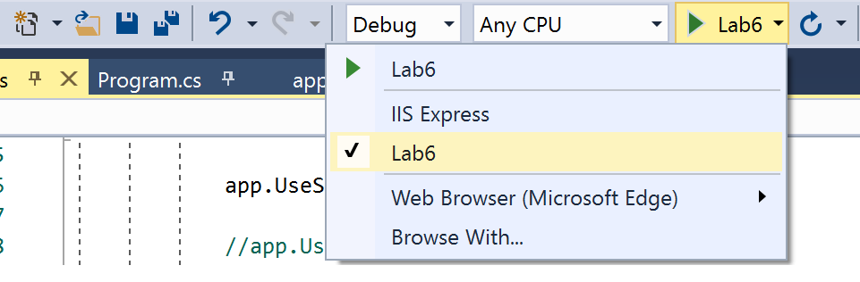
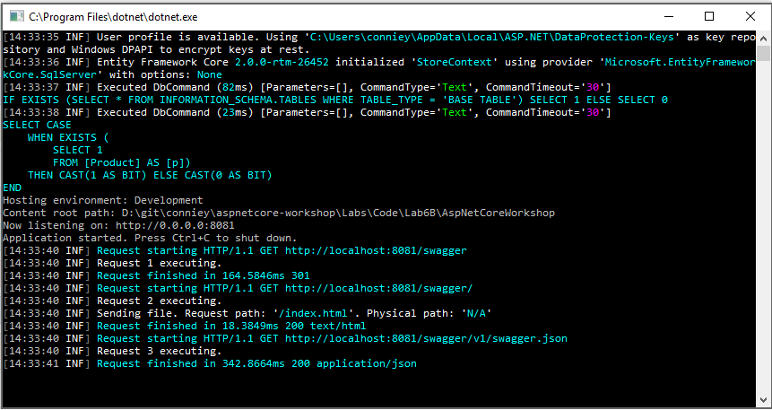
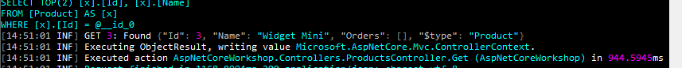

## Logging

## Setting up your application for logging
1. Open the application we modified in __Lab5: Dependency Injection & Unit Testing__

1. Navigate to `Startup.cs` and change the `Configure` method to request an `ILogger<Startup>`:
```cs
    public void Configure(IApplicationBuilder app, IHostingEnvironment env, ILogger<Startup> startupLogger)
    {
        ...
    }
```

1. Add a log statement to the end of the `Configure` method:
```cs
    public void Configure(IApplicationBuilder app, IHostingEnvironment env, ILogger<Startup> startupLogger)
    {
        ...
        startupLogger.LogInformation("Application startup complete!");
    }
```

1. In Visual Studio, change the active launch host to the application itself (self-host) by navigating to the play/run button and changing the drop-down to the entry named after the application.
      

1. Run the application and browse to the application root. You should see the default log messages from the framework as well as your custom log message in the console window.

## Filtering logs
1. Add more logging statements to the `Configure` method:
```cs
    public void Configure(IApplicationBuilder app, IHostingEnvironment env, ILogger<Startup> startupLogger)
    {
        ...
        startupLogger.LogInformation("Application startup complete!");

        startupLogger.LogCritical("This is a critical message");
        startupLogger.LogDebug("This is a debug message");
        startupLogger.LogTrace("This is a trace message");
        startupLogger.LogWarning("This is a warning message");
        startupLogger.LogError("This is an error message");
    }
```

1. Run the application and browse to the application root. You should see all of the logged messages other than the `startupLogger.LogTrace()` message in the console window.

1. Open or create `appsettings.json` in the project root. Add this node to configure the Console provider to log all Trace or higher messages:
```json
"Logging": {
    "Console": {
      "LogLevel": {
        "Default": "Trace"
      }
  }
}
```

1. Run the application. You should see more verbose logging from the framework and `Startup` including messages of all levels.

1. Add a log filter in `Program.cs` to configure the Console provider to only show logs from the `Startup` category:

```cs
        private static void SetupAppLogging(WebHostBuilderContext context, ILoggingBuilder loggingBuilder)
        {
            ...

            loggingBuilder.AddFilter<ConsoleLoggerProvider>((category, level) => {
                return category == typeof(Startup).FullName;
            });
        }
```

1. Run the application. You should see only logs written by the Startup logger.

> **Note:** Completed code for this section is found at [/Labs/Code/Lab6A](/Labs/Code/Lab6A).

## Adding other logging providers
1. Add references to the following Serilog NuGet packages:
    * "Serilog.AspNetCore"
    * "Serilog.Sinks.File"
    * "Serilog.Sinks.Console"

1. Remove our existing logging configuration by removing the following in _Program.cs_:
    * Remove method `private static void SetupAppLogging(WebHostBuilderContext context, ILoggingBuilder loggingBuilder)`
    * In `BuildWebHost(string[] args)`, remove the call `.ConfigureLogging(SetupAppLogging)`

1. Open _appsettings.json_ and _appsettings.Development.json_. Remove the "Logging" configuration section

1. Configure Serilog in _Program.cs_ to write to a file called _logfile.txt_ in the project root (adding usings for `System.IO` and `Serilog`):

```cs
    public static void Main(string[] args)
    {
        Log.Logger = new LoggerConfiguration()
            .WriteTo.File("logfile.txt")
            .WriteTo.Console()
            .CreateLogger();

        ...
    }
```

1. We want Serilog to write and flush the logs upon exit or any fatal errors. Wrap the main method in _Program.cs_ with a `try/catch`:

```cs
    public static void Main(string[] args)
    {
        Log.Logger = new LoggerConfiguration()
                .WriteTo.File("logfile.txt")
                .WriteTo.Console()
                .CreateLogger();

        try
        {
            var host = BuildWebHost(args);

            ...

            host.Run();
        }
        catch (Exception ex)
        {
            Log.Fatal(ex, "Host terminated unexpectedly");
        }
        finally
        {
            Log.CloseAndFlush();
        }
    }
```

1. Add the Serilog provider in `BuildWebHost(string[] args)` with `.UseSerilog()`:

```cs
    public static IWebHost BuildWebHost(string[] args) =>
        new WebHostBuilder()
            .UseKestrel()
            .UseContentRoot(Directory.GetCurrentDirectory())
            .ConfigureAppConfiguration(SetupAppConfiguration)
            .UseSerilog()
            .UseUrls("http://0.0.0.0:8081")
            .UseIISIntegration()
            .UseStartup<Startup>()
            .Build();
```

1. Run the application. You should observe `logfile.txt` appear in your application root. You should also see pretty colored console text like below:
      

1. Close the console window and open the file, the application logs should be in there.

1. Comment out the extra `startupLogger.Log*` lines in `Startup.Configure`
since these were just for demonstration purposes.

### Serilog: Structured Logging

1. Open _ProductsController.cs_ and in the `Get(int id)` method, add the following line before the return statement.

```cs
    public async Task<IActionResult> Get(int id)
    {
        ...

        Log.Information("GET {Id}: Found {@Product}", id, product);

        return Ok(product);
    }
```
1. Run the application and navigate to http://localhost:8081/api/products/3
1. Notice the output in the console window
      

> **Note:** Completed code for this section is found [/Labs/Code/Lab6B](/Labs/Code/Lab6B).

## Extra

Leveraging the [Serilog.Settings.Configuration](https://www.nuget.org/packages/Serilog.Settings.Configuration/) NuGet package, try the following:
1. Adding more advanced filters with different levels
1. Write a custom logging provider

More information can be found at the [Serilog.Settings.Configuration GitHub repository](https://github.com/serilog/serilog-settings-configuration).

# Diagnostic pages

## Write some buggy code

1. Add a middleware to the above application that throws an exception. Your `Configure` method should look something like this:

```cs
    public void Configure(IApplicationBuilder app, IHostingEnvironment env, ILogger<Startup> startupLogger)
    {
        if (env.IsDevelopment())
        {
            app.UseDeveloperExceptionPage();
        }

        app.Run(context => throw new InvalidOperationException("Oops!"));

        ...
    }
```

## Understanding the diagnostics middleware

1. Observe that the `Configure()` method in _Startup.cs_ includes a call to configure the developer experience middleware when running in the Development environment. Ensure that your new buggy code occurs after the exception page is wired up, as shown below:

```cs
    if (env.IsDevelopment())
    {
        app.UseDeveloperExceptionPage();
    }

    app.Run(context => throw new InvalidOperationException("Oops!"));
```

1. Open the Project Properties dialog. On the Debug tab, ensure the `ASPNETCORE_ENVIRONMENT` variable is set to "Development"
    * **Note:** The changes are being propagated to _Properties/launchSettings.json_

1. Run the application and browse to it. You should see an application exception page (if you have first-chance exceptions on, continue after the debugger breaks)

## Adding a handler for non-development environments

1. Add exception handler middleware to the `Configure` method. Make sure it only runs when not in development:

```cs
    if (env.IsDevelopment())
    {
        app.UseDeveloperExceptionPage();
    }
    else
    {
        app.UseExceptionHandler(subApp =>
        {
            subApp.Run(async context =>
            {
                context.Response.ContentType = "text/html";
                await context.Response.WriteAsync("<strong> Application error. Please contact support. </strong>");
                await context.Response.WriteAsync(new string(' ', 512));  // Padding for IE
            });
        });
    }
```

1. We're going to run the application in "Production". Open the Project Properties dialog. On the Debug tab, modify the `ASPNETCORE_ENVIRONMENT` variable to "Production"

1. Run the application in "Production" and browse to it. You should see the custom error page instead of the exception details

> **Note:** Completed code for this section is found [/Labs/Code/Lab6C](/Labs/Code/Lab6C).

## Showing custom pages for non 500 status codes

1. Change the middleware throwing the `InvalidOperationException` to set a 404 status code instead:

```cs
    app.Run(context =>
    {
        context.Response.StatusCode = 404;
        return Task.CompletedTask;
    });
```

1. Add the status code pages middleware above the exception handling middleware in `Configure`. The `{0}` will get replaced by the middleware with the status code when the status code is in the range of 400-599:

```cs
    public void Configure(IApplicationBuilder app, IHostingEnvironment env, ILogger<Startup> startupLogger)
    {
        app.UseStatusCodePages("text/html", "<p>You got a <strong>{0}</strong></p>");
        if (env.IsDevelopment())
        {
            ...
```

1. Run the application and browse to it. You should see the custom error page instead of the browser's default 404 page.

1. Remove the inline middleware setting status to 404 so that the app will be functional again for future labs. `Startup.Configure` should look like this:

```cs
    public void Configure(IApplicationBuilder app, IHostingEnvironment env, ILogger<Startup> startupLogger)
    {
        app.UseStatusCodePages("text/html", "<p>You got a <strong>{0}</strong></p>");

        if (env.IsDevelopment())
        {
            app.UseDeveloperExceptionPage();
        }
        else
        {
            app.UseExceptionHandler(subApp =>
            {
                subApp.Run(async context =>
                {
                    context.Response.ContentType = "text/html";
                    await context.Response.WriteAsync("<strong> Application error. Please contact support. </strong>");
                    await context.Response.WriteAsync(new string(' ', 512));  // Padding for IE
                });
            });
        }

        app.UseStaticFiles();

        app.UseMiddleware<RequestIdMiddleware>();

        app.UseMvc();
        app.UseSwagger();
        app.UseSwaggerUI(c => c.SwaggerEndpoint("/swagger/v1/swagger.json", "My API V1"));
    }
```

> **Note:** Completed code for this section is found [/Labs/Code/Lab6D](/Labs/Code/Lab6D).

## Extra

1. Access the exception when using the exception handler middleware, log a custom message for it. (**Note: The exception handler middleware does log the exception via the logging system.**)
1. Serve an HTML page when an exception occurs using the static files middleware and the exception handler middleware.
1. Serve an HTML page for a 404 status using the static files middleware and status code pages middleware.